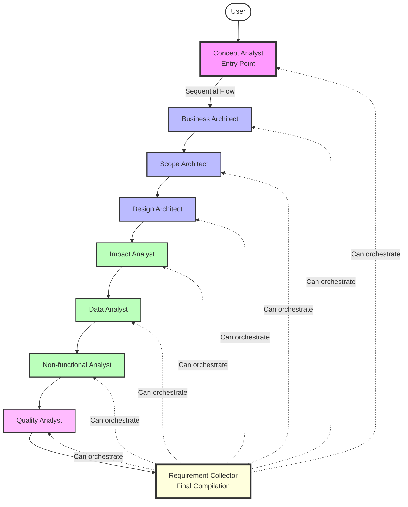

# Business Analyst Assistant - BIAN Framework Implementation

An intelligent multi-agent system designed to guide business analysts through the complete requirements lifecycle using the **BIAN (Banking Industry Architecture Network)** framework. This voice-enabled AI assistant orchestrates 9 specialized analysts who work in Czech language to create comprehensive business documentation.

## 🎯 Overview

This project implements an advanced conversational AI system using OpenAI's Realtime API and Agents SDK. The system starts with a Concept Analyst who begins collecting requirements immediately, followed by a sequential flow through specialized analysts. A Requirement Collector orchestrates the final document compilation from all analysts' outputs according to BIAN methodology.

### Key Features

- **BIAN Framework Integration**: Complete implementation of BIAN methodology
- **Multi-Agent Orchestration**: Senior analyst orchestrates 9 specialized analysts
- **Czech Language Native**: All analysts communicate exclusively in Czech
- **Voice-Enabled Interface**: Natural conversation using OpenAI's Realtime API
- **Comprehensive Documentation**: Generates complete BIAN-compliant documents
- **Professional Documentation**: Structured outputs ready for stakeholder review

## 🏗️ Architecture

### Agent Hierarchy and Workflow



### Agent Specializations

1. **Concept Analyst** (Koncepční Analytik) - **ENTRY POINT**
   - **First agent to interact with user**
   - Understanding overall picture of business requirements
   - Clarifying initial scope and boundaries  
   - Identifying key stakeholders
   - Gathering existing domain, processes and systems context
   - **Key Questions:**
     - "Můžete prosím poskytnout popis plánované změny?"
     - "Co spustilo tento požadavek?"
     - "Kdo jsou hlavní zainteresované strany?"
     - "Co je v rozsahu a co mimo rozsah?"
   - **Creates:** Section 1.1 - "Základní popis business požadavku"

2. **Business Architect** (Business Architekt)
   - Understanding business drivers and motivations ("why" behind the requirement)
   - Mapping current AS-IS state processes and problems
   - Defining measurable business goals and KPIs
   - Identifying expected business value and benefits
   - **Key Questions:**
     - "Proč je tato změna potřebná z business pohledu?"
     - "Jaké jsou měřitelné business cíle?"
     - "Jak vypadají současné procesy a kde jsou problémy?"
     - "Jaké jsou očekávané přínosy?"
   - **Creates:** 
     - Section 1.2 - "Důvody a cíle požadavku"
     - Section 2.1 - "Popis AS-IS stavu"

3. **Scope Architect** (Scope Architekt)
   - Making requirements tangible through clear scope definition
   - Explicitly defining what's included vs excluded
   - Identifying constraints and dependencies
   - Defining solution approach and implementation strategy
   - **Key Questions:**
     - "Co přesně je součástí tohoto požadavku?"
     - "Co explicitně NENÍ součástí?"
     - "Jaká jsou omezení a závislosti?"
     - "Jaký je navrhovaný přístup k řešení?"
   - **Creates:** Section 1.3 - "Co není součástí požadavku"

4. **Design Architect** (Design Architekt)
   - Creating detailed TO-BE state definition
   - Specifying functional requirements and user scenarios
   - Designing new processes and workflows
   - Defining system interactions and integration points
   - **Key Questions:**
     - "Jak přesně bude fungovat budoucí řešení?"
     - "Jaké jsou detailní funkční požadavky?"
     - "Jak budou vypadat nové procesy?"
     - "Jaké jsou integrační body?"
   - **Creates:** Section 3.1 - "Popis TO-BE stavu"

5. **Impact Analyst**
   - Analyzing system-wide impacts of proposed changes
   - Mapping technical dependencies and integration needs
   - Assessing implementation complexity
   - Identifying affected systems and components
   - **Key Questions:**
     - "Které systémy budou ovlivněny?"
     - "Jaké jsou technické závislosti?"
     - "Jak složitá bude implementace?"
     - "Jaká jsou rizika a jejich dopady?"
   - **Creates:** Section 3.2 - "Vizualizace navrhovaných změn" (with Design Architect)

6. **Data Analyst**
   - Analyzing business data requirements
   - Ensuring GDPR compliance and data privacy
   - Defining data quality standards
   - Specifying reporting and analytics needs
   - **Key Questions:**
     - "Jaké datové entity budou využívány?"
     - "Jak zajistíme GDPR compliance?"
     - "Jaké jsou požadavky na kvalitu dat?"
     - "Jaké reporty a analýzy budou potřeba?"
   - **Creates:** Section 3.3 - "Analýza požadavků na business data"

7. **Non-functional Analyst**
   - Defining performance and scalability requirements
   - Specifying usability and user experience criteria
   - Setting security and compliance standards
   - Establishing availability and reliability targets
   - **Key Questions:**
     - "Jaké jsou požadavky na výkon a odezvu?"
     - "Jaká je požadovaná dostupnost systému?"
     - "Jaké jsou bezpečnostní požadavky?"
     - "Jaké jsou požadavky na uživatelskou přívětivost?"
   - **Creates:** Section 3.4 - "Business nefunkční požadavky"

8. **Quality Analyst**
   - Defining measurable acceptance criteria
   - Creating comprehensive testing strategy
   - Establishing success metrics and KPIs
   - Specifying Definition of Done
   - **Key Questions:**
     - "Jak poznáme, že je požadavek splněn?"
     - "Jaká jsou měřitelná akceptační kritéria?"
     - "Jak budeme testovat řešení?"
     - "Jaké jsou metriky úspěchu?"
   - **Creates:** Section 4 - "Akceptační kritéria"

9. **Requirement Collector** (Orchestrator)
   - **Final stage of the process**
   - Collects outputs from all specialist analysts
   - Compiles comprehensive BIAN-compliant documentation
   - Ensures completeness and consistency across all sections
   - Validates alignment with BIAN framework standards
   - Presents final consolidated document to stakeholders

## 📚 Output Document Structure

The orchestrator compiles a comprehensive Czech document with the following structure:

```
1. POPIS POŽADAVKU
   1.1 Základní popis business požadavku (from Concept Analyst)
   1.2 Důvody a cíle požadavku (from Business Architect)  
   1.3 Co není součástí požadavku (from Scope Architect)

2. AS-IS STAV
   2.1 Popis AS-IS stavu oblasti/systému/domény/procesu (from Business Architect)

3. TO-BE STAV
   3.1 Popis TO-BE stavu oblasti/systému/domény/procesu (from Design Architect)
   3.2 Vizualizace navrhovaných změn (from Design & Impact Analysts)
   3.3 Analýza požadavků na business data (from Data Analyst)
   3.4 Business nefunkční požadavky (from Non-functional Analyst)

4. AKCEPTAČNÍ KRITÉRIA (from Quality Analyst)
```

## 🚀 Getting Started

### Prerequisites

- Node.js 18+ 
- npm or yarn
- OpenAI API key with Realtime API access

### Installation

1. Clone the repository:
```bash
git clone https://github.com/yourusername/business_analyst_CHAT.git
cd business_analyst_CHAT
```

2. Install dependencies:
```bash
npm install
```

3. Set up environment variables:
```bash
# Option 1: Export in your shell
export OPENAI_API_KEY="your-api-key-here"

# Option 2: Create .env file
echo "OPENAI_API_KEY=your-api-key-here" > .env
```

4. Start the development server:
```bash
npm run dev
```

5. Open your browser to [http://localhost:3001](http://localhost:3001)

## 💬 Usage Example

### Starting a Session

When you connect, the Concept Analyst immediately begins collecting requirements:

```
User: Connects to system

Concept Analyst: "Dobrý den, jsem Concept Analyst a budu s vámi pracovat na vyjasnění vašich business požadavků. Můžete prosím poskytnout popis plánované změny? Jaký je hlavní business problém nebo příležitost, kterou řešíte?"

User: "Potřebuji implementovat nový systém pro správu klientských dat."

Concept Analyst: "Děkuji. Co spustilo tento požadavek? Jaké jsou současné problémy s existujícím řešením?"
```

### Workflow Process

1. **Concept Phase** (Entry Point): Concept Analyst starts immediately gathering requirements
2. **Business Architecture**: Business Architect defines why the change is needed
3. **Scope Definition**: Scope Architect clarifies what's included/excluded
4. **Design Phase**: Design Architect specifies detailed TO-BE state
5. **Impact Analysis**: Impact Analyst assesses system dependencies
6. **Data Analysis**: Data Analyst defines business data requirements
7. **Non-functional Requirements**: Non-functional Analyst specifies performance, security, UX
8. **Quality Assurance**: Quality Analyst defines acceptance criteria
9. **Document Compilation**: Requirement Collector assembles final document from all outputs

## 🔧 Configuration

### Agent Configuration Files

All agents are configured in `/src/app/agentConfigs/businessAnalyst/`:
- `conceptAnalyst.ts` - Concept phase specialist (ENTRY POINT)
- `businessArchitect.ts` - Business architecture specialist
- `scopeArchitect.ts` - Scope definition specialist
- `designArchitect.ts` - Design phase specialist
- `impactAnalyst.ts` - Impact assessment specialist
- `dataAnalyst.ts` - Data analysis specialist
- `nonfunctionalAnalyst.ts` - Non-functional requirements specialist
- `qualityAnalyst.ts` - Quality assurance specialist
- `businessAnalystSenior.ts` - Requirement Collector (final compilation)
- `documentStructure.ts` - Document structure and tracking configuration

### Handoff Configuration

Agent handoffs are configured in `/src/app/agentConfigs/businessAnalyst/index.ts`:

```typescript
// Sequential handoff flow
Concept → Business Architect → Scope → Design → Impact → Data → Non-functional → Quality
```

## 📊 Key Outputs by Phase

### Concept Phase
- Overall requirement understanding
- Initial boundaries and context
- Stakeholder identification
- BIAN framework alignment

### Business Architecture
- Business drivers and motivations
- Measurable goals and KPIs
- Current state problems
- Expected benefits

### Scope Definition
- In-scope elements
- Out-of-scope elements
- Solution approach
- Implementation strategy

### Design Phase
- Detailed TO-BE processes
- Functional requirements
- User scenarios
- Integration points

### Impact Analysis
- Affected systems matrix
- Technical dependencies
- Implementation complexity
- Risk assessment

### Data Analysis
- Data entities and attributes
- GDPR compliance check
- Data quality requirements
- Reporting needs

### Non-functional Requirements
- Performance metrics
- Availability requirements
- Security specifications
- User experience criteria

### Quality Assurance
- Acceptance criteria
- Test scenarios
- Success metrics
- Definition of Done

## 🔧 Development

### Available Scripts

```bash
npm run dev              # Start development server on localhost:3001
npm run build            # Build production bundle
npm run start            # Start production server
npm run lint             # Run ESLint for code quality checks
```

### Project Structure

```
business_analyst_CHAT/
├── src/
│   ├── app/
│   │   ├── agentConfigs/
│   │   │   └── businessAnalyst/    # All 9 agent configurations
│   │   ├── components/              # React components
│   │   ├── hooks/                   # Custom React hooks
│   │   ├── contexts/                # React contexts
│   │   └── App.tsx                  # Main application
│   └── middleware.ts                # Next.js middleware
├── public/                          # Static assets
├── EXTENSION_GUIDE.md               # Guide for adding new workcenters
└── README.md                        # This file
```

## 🌐 Language Support

The system operates exclusively in **Czech language** for all business analysis activities. This includes:
- All agent communications
- Document generation
- User interactions
- Output formatting

## 🔒 Security & Compliance

- **GDPR Compliance**: Built-in data privacy checks via Data Analyst
- **Audit Trail**: Complete conversation history tracking
- **Guardrails**: Output moderation for compliance
- **Secure Communication**: HTTPS-only, encrypted API communications

## 📖 Extending the System

For adding new workcenters or business domains, see [EXTENSION_GUIDE.md](EXTENSION_GUIDE.md) which provides:
- Step-by-step instructions for new agent creation
- Handoff pattern examples
- Configuration templates
- Best practices

## 🤝 Contributing

We welcome contributions! Please:
1. Fork the repository
2. Create a feature branch
3. Commit your changes
4. Push to the branch
5. Open a Pull Request

## 📄 License

This project is licensed under the MIT License - see the [LICENSE](LICENSE) file for details.

## 🙏 Acknowledgments

- Built with [OpenAI Realtime API](https://platform.openai.com/docs/guides/realtime)
- Uses [OpenAI Agents SDK](https://github.com/openai/openai-agents-js)
- Implements [BIAN Framework](https://bian.org/) standards
- Powered by [Next.js](https://nextjs.org/) and [React](https://reactjs.org/)

## 📧 Support

For questions or support, please open an issue in the GitHub repository.

---

**Note**: This system is designed for Czech-speaking business analysts working with BIAN framework. Ensure you have appropriate OpenAI API access and understand the BIAN methodology before deployment in production environments.