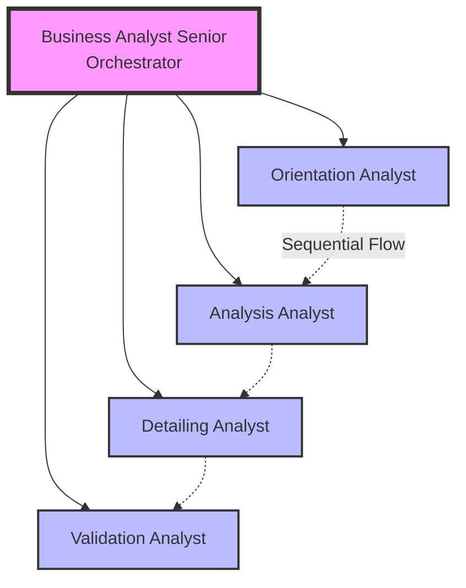

# Business Analyst Assistant - BIAN Framework Implementation

An intelligent multi-agent system designed to guide business analysts through the complete requirements lifecycle using the **BIAN (Banking Industry Architecture Network)** framework. This voice-enabled AI assistant helps structure business requirements into domains, service domains, business objects, and generic APIs that are both business-understandable and IT-implementable. 

## 🎯 Overview

This project implements an advanced conversational AI system using OpenAI's Realtime API and Agents SDK. It features a Senior Business Analyst orchestrator managing specialized junior analysts, each responsible for a specific phase of the business analysis lifecycle.

### Key Features

- **BIAN Framework Integration**: Automatic mapping of requirements to BIAN taxonomy components
- **Multi-Agent Orchestration**: Senior analyst manages junior specialists for optimal results
- **Voice-Enabled Interface**: Natural conversation using OpenAI's Realtime API
- **Structured Methodology**: Follows proven BA lifecycle (Orientation → Analysis → Detailing → Validation)
- **Real-time Collaboration**: Seamless handoffs between specialized agents
- **Professional Documentation**: Generates structured, deliverable-ready outputs

## 🏗️ Architecture

### Agent Hierarchy



### Agent Specializations

1. **Business Analyst Senior** (Orchestrator)
   - Overall workflow management
   - Quality assurance and compliance
   - Strategic oversight and final validation
   - Delegation to appropriate specialists

2. **Orientation Analyst**
   - Context and goal clarification
   - Stakeholder identification
   - Boundary definition
   - Initial BIAN mapping

3. **Analysis Analyst**
   - AS-IS state documentation
   - TO-BE state design
   - Gap analysis
   - Business object mapping

4. **Detailing Analyst**
   - System impact analysis
   - Data requirements specification
   - Non-functional requirements
   - API specification

5. **Validation Analyst**
   - Acceptance criteria definition
   - Success metrics establishment
   - Test scenario development
   - Stakeholder alignment

## 🚀 Getting Started

### Prerequisites

- Node.js 18+ 
- npm or yarn
- OpenAI API key with Realtime API access

### Installation

1. Clone the repository:
```bash
git clone https://github.com/yourusername/business_analyst_CHAT.git
cd business_analyst_CHAT
```

2. Install dependencies:
```bash
npm install
```

3. Set up environment variables:
```bash
# Option 1: Export in your shell
export OPENAI_API_KEY="your-api-key-here"

# Option 2: Create .env file
echo "OPENAI_API_KEY=your-api-key-here" > .env

# Option 3: Add to ~/.bash_profile or ~/.zshrc
```

4. Start the development server:
```bash
npm run dev
```

5. Open your browser to [http://localhost:4000](http://localhost:4000)

## 📋 BIAN Framework Methodology

### Lifecycle Phases

#### 1. Orientation Phase
- **Purpose**: Establish context and boundaries
- **Key Activities**:
  - Requirement clarification
  - Stakeholder mapping
  - Scope definition
- **BIAN Outputs**:
  - Service Domain identification
  - Business Area classification
  - Initial Business Objects

#### 2. Analysis Phase
- **Purpose**: Define current vs. future states
- **Key Activities**:
  - AS-IS process documentation
  - TO-BE state design
  - Gap analysis
- **BIAN Outputs**:
  - Business Object specifications
  - Generic API identification
  - Service interactions

#### 3. Detailing Phase
- **Purpose**: Technical specification
- **Key Activities**:
  - System impact assessment
  - Data requirements definition
  - NFR documentation
- **BIAN Outputs**:
  - API operation details
  - Data attribute mappings
  - Integration specifications

#### 4. Validation Phase
- **Purpose**: Ensure deliverable quality
- **Key Activities**:
  - Acceptance criteria definition
  - Success metrics establishment
  - Test scenario creation
- **BIAN Outputs**:
  - Service operation validation
  - Business outcome mapping
  - Compliance confirmation

## 💬 Usage Examples

### Starting a Session

When you connect, the Senior Business Analyst will greet you and ask about your requirements. Example interactions:

```
User: "I need to implement a new payment processing system for international transfers."

Senior BA: "I'll help you structure this requirement using the BIAN framework. Let me hand this over to our Orientation Analyst to gather the initial details."

Orientation Analyst: "Let's start by understanding the core business problem. Can you describe what specific challenges you're facing with international transfers currently?"
```

### BIAN Mapping Example

The system automatically maps requirements to BIAN components:

```yaml
Service Domain: Payments Execution
Business Domain: Payment Services
Business Area: Payments
Business Objects:
  - Payment Order
  - Payment Transaction
  - Settlement Instruction
Generic APIs:
  - Initiate: Start payment processing
  - Update: Modify payment details
  - Retrieve: Query payment status
  - Execute: Process payment
```

## 🔧 Configuration

### Agent Configuration

Agents are configured in `/src/app/agentConfigs/businessAnalyst/`:
- `businessAnalystSenior.ts` - Orchestrator configuration
- `orientationAnalyst.ts` - Orientation phase specialist
- `analysisAnalyst.ts` - Analysis phase specialist
- `detailingAnalyst.ts` - Detailing phase specialist
- `validationAnalyst.ts` - Validation phase specialist

### Customizing Agents

To modify agent behavior, edit the respective configuration files:

```typescript
export const orientationAnalyst = new RealtimeAgent({
  name: 'Orientation Analyst',
  voice: 'echo',
  instructions: `Your custom instructions here...`,
  tools: [], // Add custom tools if needed
});
```

### Handoff Configuration

Agent handoffs are configured in `/src/app/agentConfigs/businessAnalyst/index.ts`:

```typescript
// Senior can hand off to any junior
(businessAnalystSenior.handoffs as any).push(
  orientationAnalyst,
  analysisAnalyst,
  detailingAnalyst,
  validationAnalyst
);
```
## 📊 Output Formats

The system generates structured outputs at each phase:

### Orientation Output
- Business requirement statement
- Stakeholder matrix
- Scope boundaries
- BIAN taxonomy mapping

### Analysis Output
- AS-IS/TO-BE comparison
- Gap analysis matrix
- Transformation roadmap
- Business object inventory

### Detailing Output
- System architecture diagrams
- Data models and schemas
- Integration specifications
- NFR compliance matrix

### Validation Output
- Acceptance criteria checklist
- KPI dashboard definition
- Test execution plan
- Sign-off documentation

## 🔧 Development

### Available Scripts

```bash
npm run dev              # Start development server on localhost:4000
npm run build            # Build production bundle
npm run start            # Start production server
npm run lint             # Run ESLint for code quality checks
```

### Project Structure

```
business_analyst_CHAT/
├── src/
│   ├── app/
│   │   ├── agentConfigs/
│   │   │   └── businessAnalyst/    # BA agent configurations
│   │   ├── components/              # React components
│   │   ├── hooks/                   # Custom React hooks
│   │   └── App.tsx                  # Main application
│   └── middleware.ts                # Next.js middleware
├── public/                          # Static assets
└── README.md                        # This file
```

## 🔒 Security & Compliance

- **GDPR Compliance**: Data attribute specifications include privacy requirements
- **Audit Trail**: Complete conversation history and decision tracking
- **Guardrails**: Output moderation for compliance and quality
- **Secure Communication**: HTTPS-only, encrypted API communications

## 🤝 Contributing

We welcome contributions! Please:
1. Fork the repository
2. Create a feature branch
3. Commit your changes
4. Push to the branch
5. Open a Pull Request

## 📄 License

This project is licensed under the MIT License - see the [LICENSE](LICENSE) file for details.

## 🙏 Acknowledgments

- Built with [OpenAI Realtime API](https://platform.openai.com/docs/guides/realtime)
- Uses [OpenAI Agents SDK](https://github.com/openai/openai-agents-js)
- Implements [BIAN Framework](https://bian.org/) standards
- Powered by [Next.js](https://nextjs.org/) and [React](https://reactjs.org/)

## 📧 Support

For questions or support, please open an issue in the GitHub repository.

---

**Note**: This system is designed for enterprise business analysis workflows. Ensure you have appropriate OpenAI API access and understand the BIAN framework before deployment in production environments.
